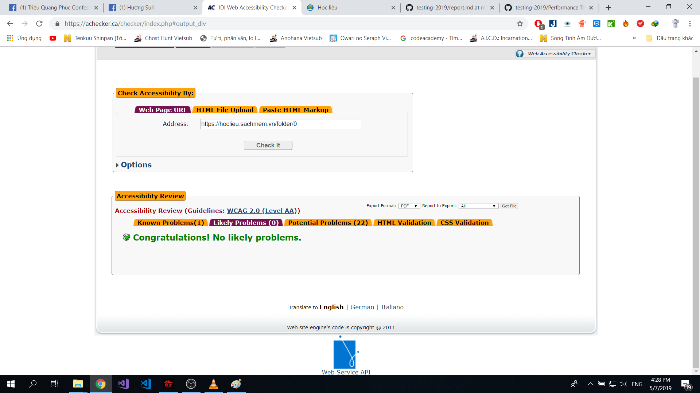

# Hướng dẫn sử dụng công cụ Achecker 
AChecker (Accessibility Checker) là một công cụ kiểm tra khả năng tiếp cận được thiết kế để giúp những người phát triển nội dung Web chắc chắn rằng sản phẩm của họ dễ tiếp cận với tất cả mọi người không phụ thuộc vào công nghệ và khả năng sử dụng của họ.
Đây là một công cụ miễn phí, bằng cách nhập URL trang Web hoặc tải lên file Html, AChecker sẽ giúp chúng ta kiểm tra khả năng tiếp cận của các trang web, dựa trên một loạt các hướng dẫn tiếp cận  tiêu chuẩn quốc tế.
Các nhà phát triển web có thể sử dụng nó để phát hiện những sơ hở accesability và cải thiện trang web của họ.
AChecker có phiên bản Online và Offline

Video hướng dẫn :https://youtu.be/2sJ5FTp7N-I


## Cách sử dụng AChecker
### 1. Vào trang web chứa công cụ
```
https://achecker.ca/checker/index.php
```
### 2. Tạo tài khoản 
 

### 3. Đăng nhập


### 4. Giao diện trang web
Để tiến hành Check Accessibility, ta có thể lựa chọn 3 cách đó là :
- Dùng URL của trang web
- Upload file HTML
- Paste trực tiếp mã nguồn HTML
Trong bài này, mình sẽ sử dụng cách thứ nhất 
Ta copy URL từ trang 
```
https://hoclieu.sachmem.vn/folder/0
```
vào khung nhập Address.
Phần option ta có thể chọn HTML , CSS validator để kiểm tra xem trang web có theo chuẩn W3C hay không.

Sau đó, ta chọn ô Check it

### 5. Review Accessibility
Sau khi check , ta có thể thấy hiện ra thông báo.

Mỗi thông báo lỗi đều có cách để fix hiển thị cùng

-Phần thứ nhất là Known Problems là những lỗi rõ ràng


-Phần thứ 2 là Likely Problems là những phần mà tùy vào mỗi người nó có thể là lỗi hoặc không


-Phần thứ 3 là Potential Problems là những lỗi tiềm tàng, chưa gây ảnh hưởng nhưng có thể gây hại sau này
 
 
-Phần thứ 4 là HTML Validation, xem HTML trang web có theo chuẩn W3C hay không

Có thể test kỹ hơn trên trang web :
```
http://validator.w3.org/
```


-Phần thứ 5 tương tự như phần 4 nhưng với Css

Trang web để test:
```
http://jigsaw.w3.org/css-validator
```

Lỗi trên trang hoclieu:

### 6. Get file 
Chúng ta có thể get file review này dưới các dạng PDF, EARL, CSV, HTML


