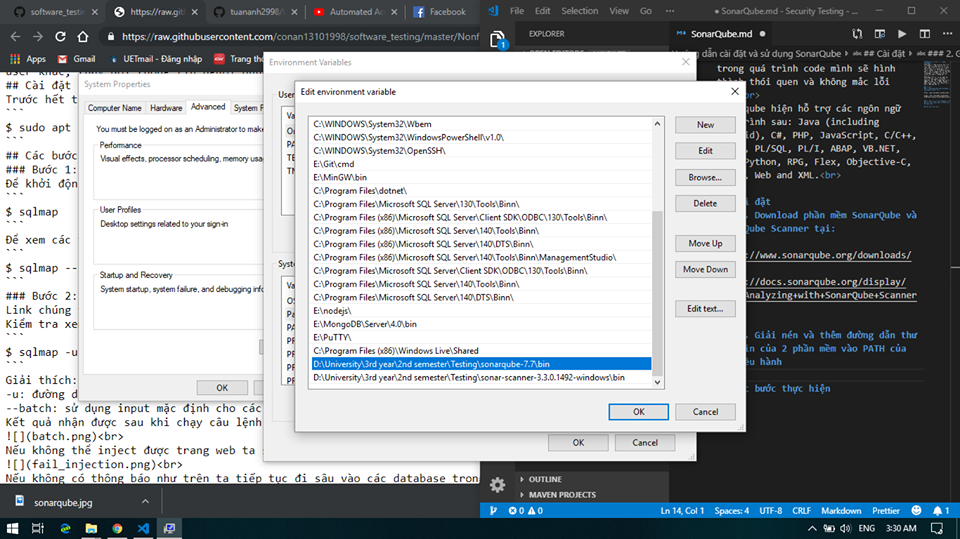
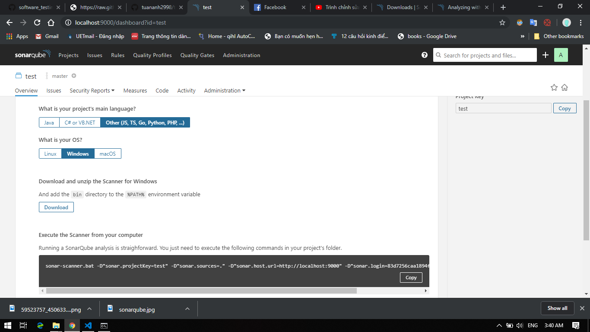
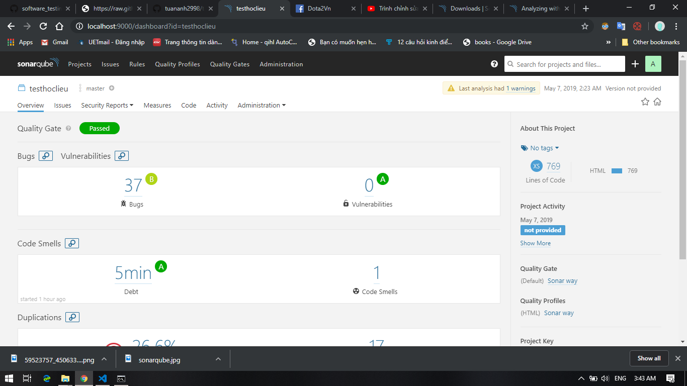

# Hướng dẫn cài đặt và sử dụng SonarQube
Sonarqube là công cụ giúp lập trình viên kiểm tra code của mình đã tốt chưa, nếu có bất kì lỗi nào vi phạm hay có nguy cơ vi phạm nguyên tắc (chuẩn chung) thì nó sẽ giúp ta cảnh báo và đưa ra suggest để sửa, dần dần trong quá trình code mình sẽ hình thành thói quen và không mắc lỗi nữa.<br> 
Sonarqube hiện hỗ trợ các ngôn ngữ lập trình sau: Java (including Android), C#, PHP, JavaScript, C/C++, COBOL, PL/SQL, PL/I, ABAP, VB.NET, VB6, Python, RPG, Flex, Objective-C, Swift, Web and XML.<br>

## Cài đặt 
### 1. Download phần mềm SonarQube và SonarQube Scanner tại:
```
https://www.sonarqube.org/downloads/

https://docs.sonarqube.org/display/SCAN/Analyzing+with+SonarQube+Scanner
```

### 2. Giải nén và thêm đường dẫn thư mục bin của 2 phần mềm vào PATH của hệ điều hành
<br>
## Các bước thực hiện
### Bước 1: Khởi động SonarQube
Để khởi động, ta mở theo đường dẫn
```
\sonarqube-7.7\bin\windows-x86-64
```
Mở file StartSonar.bat, chờ cho SonarQube khởi động.<br>
Khởi động xong, vào trình duyệt mở trang:
```
http://localhost:9000/
```
Đăng nhập với tài khoản và mật khẩu lần lượt là admin/admin.<br>
### Bước 2: Tạo project
- Chọn Create new project<br>
- Điền key cho project (bất kỳ)<br>
- Sinh token (nhớ lưu token lại để dùng cho lần sau)/hoặc dùng lại token cũ<br>
- Chọn ngôn ngữ của project cần test. Vì test trang hoclieu.vn nên ta sẽ chọn Other<br>
- Chọn HĐH<br>
- Mở thư mục chứa HTML của hoclieu.vn, chạy câu lệnh Scanner bằng Command Line tại thư mục đó<br>
<br>
### Bước 3: Đọc kết quả
<br>
Sau khi Scanner xong, sẽ xuất hiện kết quả test trên SonarQube<br>
Các thông tin về bug, vulnerabilities (security), code smell sẽ được hiển thị ở đây<br>
Theo như chúng ta thấy ở đây không có lỗi gì về security ở trang hoclieu.vn<br>
## Kết quả khi áp dụng SonarQube để kiểm thử với hoclieu.vn
Không thể phát hiện lỗ hổng trên trang hoclieu.vn
